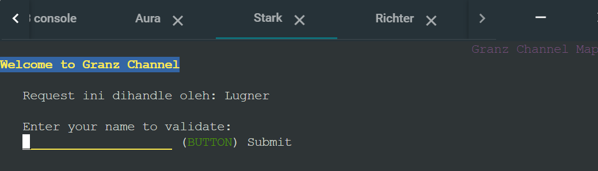
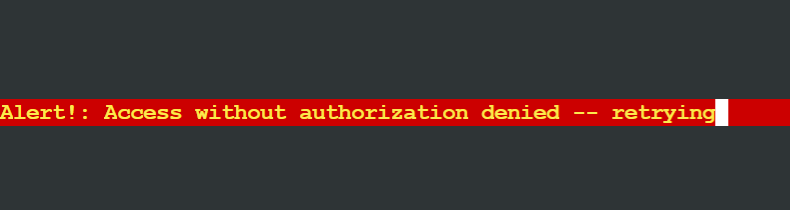

# Laporan Resmi Praktikum Jaringan Komputer Modul 3 2023

Repository in **_Bahasa_**

**Topic :**

Dynamic Host Configuration Protocol (DHCP) & Proxy

**Identity :**

Kelompok F07 -
Jaringan Komputer (F) </br>
_Insitut Teknologi Sepuluh Nopember_

**Authors :**
| Name | Student ID |
| ----------------------------------|------------|
| Arfi Raushani Fikra | 5025211084 |
| Rafi Aliefian Putra Ramadhani | 5025211234 |

# List of Contents

- [Preparation](#preparation)
  - [Topology](#network-topology)
  - [Node Config](#node-configuration)
  - [Starting](#starting)
- [Question 0 & 1](#question-0--1)
- [Question 2](#question-2)
- [Question 3](#question-3)
- [Question 4](#question-4)
- [Question 5](#question-5)
- [Question 6](#question-6)
- [Question 7](#question-7)
- [Question 8](#question-8)
- [Question 9](#question-9)
- [Question 10](#question-10)
- [Question 11](#question-11)
- [Question 12](#question-12)
- [Question 13](#question-13)
- [Question 14](#question-14)
- [Question 15](#question-15)
- [Question 16](#question-16)
- [Question 17](#question-17)
- [Question 18](#question-18)
- [Question 19](#question-19)
- [Question 20](#question-20)
- [Obstacle](#obstacle)

# Preparation

> Must be known before starting configuration

## Network Topology


## Node Configuration

- **Router**

  - Aura (DHCP Relay)

  ```
  auto eth0
  iface eth0 inet dhcp

  auto eth1
  iface eth1 inet static
    address 10.55.1.0
    netmask 255.255.255.0

  auto eth2
  iface eth2 inet static
    address 10.55.2.0
    netmask 255.255.255.0

  auto eth3
  iface eth3 inet static
    address 10.55.3.0
    netmask 255.255.255.0

  auto eth4
  iface eth4 inet static
    address 10.55.4.0
    netmask 255.255.255.0
  ```

- **Switch 1**

  - Himmel (DHCP Server)

  ```
  auto eth0
  iface eth0 inet static
    address 10.55.1.1
    netmask 255.255.255.0
    gateway 10.55.1.0
  ```

  - Heiter (DNS Server)

  ```
  auto eth0
  iface eth0 inet static
    address 10.55.1.2
    netmask 255.255.255.0
    gateway 10.55.1.0
  ```

- **Switch 2**

  - Denken (Database Server)

  ```
  auto eth0
  iface eth0 inet static
    address 10.55.2.1
    netmask 255.255.255.0
    gateway 10.55.2.0
  ```

  - Eisen (Load Balancer)

  ```
  auto eth0
  iface eth0 inet static
    address 10.55.2.2
    netmask 255.255.255.0
    gateway 10.55.2.0
  ```

- **Switch 3**

  - Lawine (PHP Worker)

  ```
  auto eth0
  iface eth0 inet static
    address 10.55.3.1
    netmask 255.255.255.0
    gateway 10.55.3.0
  ```

  - Linie (PHP Worker)

  ```
  auto eth0
  iface eth0 inet static
    address 10.55.3.2
    netmask 255.255.255.0
    gateway 10.55.3.0
  ```

  - Lugner (PHP Worker)

  ```
  auto eth0
  iface eth0 inet static
    address 10.55.3.3
    netmask 255.255.255.0
    gateway 10.55.3.0
  ```

  - Richter (Client)

  ```
  auto eth0
  iface eth0 inet dhcp
  ```

  - Revolte (Client)

  ```
  auto eth0
  iface eth0 inet dhcp
  ```

- **Switch 4**
  - Frieren (Laravel Worker)
  ```
  auto eth0
  iface eth0 inet static
    address 10.55.4.1
    netmask 255.255.255.0
    gateway 10.55.4.0
  ```
  - Flamme (Laravel Worker)
  ```
  auto eth0
  iface eth0 inet static
    address 10.55.4.2
    netmask 255.255.255.0
    gateway 10.55.4.0
  ```
  - Fern (Laravel Worker)
  ```
  auto eth0
  iface eth0 inet static
    address 10.55.4.3
    netmask 255.255.255.0
    gateway 10.55.4.0
  ```
  - Stark (Client)
  ```
  auto eth0
  iface eth0 inet dhcp
  ```
  - Sein (Client)
  ```
  auto eth0
  iface eth0 inet dhcp
  ```

## Starting

Aura (DHCP Relay)

```
iptables -t nat -A POSTROUTING -o eth0 -j MASQUERADE -s 10.55.0.0/16
```

---

## Question 0 & 1

> Lakukan konfigurasi sesuai dengan peta yang sudah diberikan.

Setelah melakukan _Node Configuration_, langkah selanjutnya diberikan perintah menambahkan register domain berupa `riegel.canyon.f07.com` untuk Laravel Worker dan `granz.channel.f07.com` untuk PHP Worker yang mengarah pada IP **10.55.x.1**.

Langkah yang dilakukan yaitu melakukan konfigurasi pada Heiter (DNS Server) seperti berikut:

```
echo nameserver 192.168.122.1 > /etc/resolv.conf
apt-get update
apt-get install bind9 -y

echo 'zone "riegel.canyon.f07.com" {
        type master;
        file "/etc/bind/jarkom/riegel.canyon.f07.com";
};

zone "granz.channel.f07.com" {
        type master;
        file "/etc/bind/jarkom/granz.channel.f07.com";
};' > /etc/bind/named.conf.local

mkdir /etc/bind/jarkom

echo ';
; BIND data file for local loopback interface
;
$TTL    604800
@       IN      SOA     riegel.canyon.f07.com. root.riegel.canyon.f07.com. (
                        2023111301      ; Serial
                        604800          ; Refresh
                        86400           ; Retry
                        2419200         ; Expire
                        604800 )        ; Negative Cache TTL
;
@               IN      NS      riegel.canyon.f07.com.
@               IN      A       10.55.4.1 ; IP Frieren Laravel Workerr' > /etc/bind/jarkom/riegel.canyon.f07.com

echo ';
; BIND data file for local loopback interface
;
$TTL    604800
@       IN      SOA     granz.channel.f07.com.  root.granz.channel.f07.com.  (
                        2023111301      ; Serial
                        604800          ; Refresh
                        86400           ; Retry
                        2419200         ; Expire
                        604800 )        ; Negative Cache TTL
;
@               IN      NS      granz.channel.f07.com.
@               IN      A       10.55.3.1 ; IP Lawine PHP Worker' > /etc/bind/jarkom/granz.channel.f07.com

echo 'options {
        directory "/var/cache/bind";

        forwarders {
                192.168.122.1;
        };

        // dnssec-validation auto;
        allow-query{any;};
        auth-nxdomain no;    # conform to RFC1035
        listen-on-v6 { any; };
}; ' >/etc/bind/named.conf.options

service bind9 restart
```

### Test Result

Pertama-tama, lakukan Download keperluan untuk testing

```
echo nameserver 192.168.122.1 > /etc/resolv.conf
apt-get update
apt-get install dnsutils
```

Kedua, ubah setting config pada Client yang semula `Dynamic` menjadi `Static` untuk keperluan testing Domain. Contoh pada node `Stark`

```
auto eth0
iface eth0 inet static
	address 10.55.4.4
	netmask 255.255.255.0
	gateway 10.55.4.0
```

Setelah itu ubah IP pada `/etc/resolv.conf` dengan IP Heiter (DNS Server) dan terakhir lakukan `host -t A` pada Domain yang telah dibuat

```
echo nameserver 10.55.1.2 > /etc/resolv.conf
```

```
host -t A riegel.canyon.f07.com
host -t A granz.channel.f07.com
```


## Question 2

> Client yang melalui Switch3 mendapatkan range IP dari [prefix IP].3.16 - [prefix IP].3.32 dan [prefix IP].3.64 - [prefix IP].3.80. **Prefix IP = 10.55**

Pertama, setup dan download keperluan berikut pada node `Himmel (DHCP Server)`

```
echo nameserver 192.168.122.1 > /etc/resolv.conf
apt-get update
apt-get install isc-dhcp-server -y
dhcpd --version

echo INTERFACES="eth0" > /etc/default/isc-dhcp-server
```

Kedua, lakukan konfigurasi berikut untuk menentukan range IP Client yang melalui Switch3

```
echo 'subnet 10.55.1.0 netmask 255.255.255.0 {
}

subnet 10.55.2.0 netmask 255.255.255.0 {
}

subnet 10.55.3.0 netmask 255.255.255.0 {
    range 10.55.3.16 10.55.3.32; # range ip untuk client
    range 10.55.3.64 10.55.3.80; # range ip untuk client
    option routers 10.55.3.0; # ip gateway switch3
    option broadcast-address 10.55.3.255; # mirip ip subnet dengan byte terakhir 255
    option domain-name-servers 10.55.1.2; # ip dns server
    default-lease-time 180; # 3 menit
    max-lease-time 5760; # 96 menit
}' > /etc/dhcp/dhcpd.conf
```

## Question 3

> Client yang melalui Switch4 mendapatkan range IP dari [prefix IP].4.12 - [prefix IP].4.20 dan [prefix IP].4.160 - [prefix IP].4.168. **Prefix IP = 10.55**

Sama seperti `Question 2`, langkah yang dilakukan adalah dengan menambahkan konfigurasi subnet seperti berikut

```
echo 'subnet 10.55.1.0 netmask 255.255.255.0 {
}

subnet 10.55.2.0 netmask 255.255.255.0 {
}

subnet 10.55.3.0 netmask 255.255.255.0 {
    range 10.55.3.16 10.55.3.32; # range ip untuk client
    range 10.55.3.64 10.55.3.80; # range ip untuk client
    option routers 10.55.3.0; # ip gateway switch3
    option broadcast-address 10.55.3.255; # mirip ip subnet dengan byte terakhir 255
    option domain-name-servers 10.55.1.2; # ip dns server
    default-lease-time 180; # 3 menit
    max-lease-time 5760; # 96 menit
}

subnet 10.55.4.0 netmask 255.255.255.0 {
        range 10.55.4.12 10.55.4.20;
        range 10.55.4.160 10.55.4.168;
        option routers 10.55.4.0;
}' > /etc/dhcp/dhcpd.conf
```

## Question 4

> Client mendapatkan DNS dari Heiter dan dapat terhubung dengan internet melalui DNS tersebut

Agar Domain yang telah dibuat dapat digunakan, perlu menambahkan konfigurasi tambahan **option broadcast-address** dan **option domain-name-servers** pada `dhcpd.conf` terutama pada subnet 3 dan 4

```
echo 'subnet 10.55.1.0 netmask 255.255.255.0 {
}

subnet 10.55.2.0 netmask 255.255.255.0 {
}

subnet 10.55.3.0 netmask 255.255.255.0 {
    range 10.55.3.16 10.55.3.32; # range ip untuk client
    range 10.55.3.64 10.55.3.80; # range ip untuk client
    option routers 10.55.3.0; # ip gateway switch3
    option broadcast-address 10.55.3.255; # mirip ip subnet dengan byte terakhir 255
    option domain-name-servers 10.55.1.2; # ip dns server
    default-lease-time 180; # 3 menit
    max-lease-time 5760; # 96 menit
}

subnet 10.55.4.0 netmask 255.255.255.0 {
        range 10.55.4.12 10.55.4.20;
        range 10.55.4.160 10.55.4.168;
        option routers 10.55.4.0;
        option broadcast-address 10.55.4.255;
        option domain-name-servers 10.55.1.2;
}' > /etc/dhcp/dhcpd.conf
```

## Question 5

> Lama waktu DHCP server meminjamkan alamat IP kepada Client yang melalui Switch3 selama 3 menit sedangkan pada client yang melalui Switch4 selama 12 menit. Dengan waktu maksimal dialokasikan untuk peminjaman alamat IP selama 96 menit

Untuk menambahkan durasi waktu dalam peminjaman IP, dibutuhkan konfigurasi tambahan **default-lease-time** dan **max-lease-time** pada `dhcpd.conf` terutama pada subnet 3 dan 4

```
echo 'subnet 10.55.1.0 netmask 255.255.255.0 {
}

subnet 10.55.2.0 netmask 255.255.255.0 {
}

subnet 10.55.3.0 netmask 255.255.255.0 {
    range 10.55.3.16 10.55.3.32; # range ip untuk client
    range 10.55.3.64 10.55.3.80; # range ip untuk client
    option routers 10.55.3.0; # ip gateway switch3
    option broadcast-address 10.55.3.255; # mirip ip subnet dengan byte terakhir 255
    option domain-name-servers 10.55.1.2; # ip dns server
    default-lease-time 180; # 3 menit
    max-lease-time 5760; # 96 menit
}

subnet 10.55.4.0 netmask 255.255.255.0 {
        range 10.55.4.12 10.55.4.20;
        range 10.55.4.160 10.55.4.168;
        option routers 10.55.4.0;
        option broadcast-address 10.55.4.255;
        option domain-name-servers 10.55.1.2;
        default-lease-time 720;
        max-lease-time 5760;
}' > /etc/dhcp/dhcpd.conf

service isc-dhcp-server restart
service isc-dhcp-server status
```

Setelah berhasil konfigurasi DHCP Server (Himmel), selanjutnya adalah melakukan konfigurasi untuk DHCP Relay (Aura). Konfigurasi yang dilakukan seperti berikut:

```
apt-get update
apt-get install isc-dhcp-relay -y
service isc-dhcp-relay start

echo '
SERVERS="10.55.1.1"
INTERFACES="eth1 eth2 eth3 eth4"
OPTIONS=""' > /etc/default/isc-dhcp-relay

echo 'net.ipv4.ip_forward=1' > /etc/sysctl.conf

service isc-dhcp-relay restart
```

### Test Result

Jika telah melakukan konfigurasi DHCP Server dan Relay, selanjutnya adalah pembuktian (testing), dilakukan pada Client dengan menjalankan konfigurasi berikut:

1. Ubah IP yang tadinya `Static` menjadi `Dynamic` kembali

```
echo '
auto eth0
iface eth0 inet dhcp
' > /etc/network/interfaces
```

2. Stop Client, Jalankan/Start Client kembali dan jalankan command berikut

```
ip a
```


## Question 6

> Pada masing-masing worker PHP, lakukan konfigurasi virtual host untuk website berikut dengan menggunakan php 7.3.

Langkah pertama adalah melakukan setup konfigurasi download dan server pada `Eisen (Load Balancer)`

```
echo nameserver 192.168.122.1 > /etc/resolv.conf
apt-get update
apt-get install bind9 nginx -y

echo '
 upstream myweb  {
        server 10.55.3.1; #IP Lawine
        server 10.55.3.2; #IP Linie
        server 10.55.3.3; #IP Lugner
 }

 server {
        listen 80;
        server_name granz.channel.f07.com;

        location / {
        proxy_pass http://myweb;
        }
 }' > /etc/nginx/sites-available/lb-jarkom

ln -s /etc/nginx/sites-available/lb-jarkom /etc/nginx/sites-enabled
rm -rf /etc/nginx/sites-enabled/default

service nginx restart
nginx -t
```

Langkah kedua, dikarenakan soal meminta konfigurasi virtual host pada PHP Worker, maka lakukan konfigurasi untuk tiap PHP Worker (Lawine, Linie, Lugner).

1. Instalasi, Download resource website yang akan digunakan, dan Setup page

```
echo nameserver 192.168.122.1 > /etc/resolv.conf
apt-get update
apt-get install lynx -y
apt-get install wget -y
apt-get install unzip -y
apt-get install nginx -y
apt-get install php7.3 -y
apt-get install php7.3-fpm -y

mkdir -p /var/www/granz.channel.f07

wget --no-check-certificate 'https://drive.google.com/uc?export=download&id=1ViSkRq7SmwZgdK64eRbr5Fm1EGCTPrU1' -O /var/www/granz.channel.f07.zip
unzip /var/www/granz.channel.f07.zip -d /var/www/granz.channel.f07
mv /var/www/granz.channel.f07/modul-3 /var/www/granz.channel.f07
rm -rf /var/www/granz.channel.f07.zip
```

2. Ubah IP Internet menjadi IP DNS Server dan mengatur sites dari `granz.channel.f07` dengan `PHP 7.3`

```
echo nameserver 10.55.1.2 > /etc/resolv.conf

echo '
server {

        listen 80;

        root /var/www/granz.channel.f07;

        index index.php index.html index.htm;
        server_name _;

        location / {
                        try_files $uri $uri/ /index.php?$query_string;
        }

        # pass PHP scripts to FastCGI server
        location ~ \.php$ {
        include snippets/fastcgi-php.conf;
        fastcgi_pass unix:/var/run/php/php7.3-fpm.sock;
        }

location ~ /\.ht {
                        deny all;
        }

        error_log /var/log/nginx/jarkom_error.log;
        access_log /var/log/nginx/jarkom_access.log;
 }' > /etc/nginx/sites-available/granz.channel.f07
```

3. Mengambil Index dari resources yang diberikan kemudian melakukan passing pada halaman Index untuk `granz.channel.f07.com` dan buat symbolic link dari `granz.channel.f07.com`

```
echo '<!DOCTYPE html>
<html>
<head>
    <title>Granz Channel Map</title>
    <link rel="stylesheet" type="text/css" href="css/styles.css">
</head>
<body>
    <div class="container">
        <h1>Welcome to Granz Channel</h1>
        <p><?php
            $hostname = gethostname();
            echo "Request ini dihandle oleh: $hostname<br>"; ?> </p>
        <p>Enter your name to validate:</p>
        <form method="POST" action="index.php">
            <input type="text" name="name" id="nameInput">
            <button type="submit" id="submitButton">Submit</button>
        </form>
        <p id="greeting"><?php
            if(isset($_POST['name'])) {
                $name = $_POST['name'];
                echo "Hello, $name!";
            }
        ?></p>
    </div>

    <script src="js/script.js"></script>
</body>' > /var/www/granz.channel.f07/index.php

ln -s /etc/nginx/sites-available/granz.channel.f07 /etc/nginx/sites-enabled
rm -rf /etc/nginx/sites-enabled/default
```

4. Restarting dan testing

```
service php7.3-fpm start
service php7.3-fpm restart
service nginx restart
nginx -t
```

Langkah ketiga, sebelum testing, pada Heiter (DNS Server) ubah `granz.channel.f07.com` yang semula terdaftar sebagai **IP Lawine PHP Worker 10.55.3.1** menjadi **IP Eisen Load Balancer 10.55.2.2**

```
echo ';
; BIND data file for local loopback interface
;
$TTL    604800
@       IN      SOA     granz.channel.f07.com.  root.granz.channel.f07.com.  (
                        2023111301      ; Serial
                        604800          ; Refresh
                        86400           ; Retry
                        2419200         ; Expire
                        604800 )        ; Negative Cache TTL
;
@               IN      NS      granz.channel.f07.com.
@               IN      A       10.55.2.2 ; IP Eisen Load Balancer' > /etc/bind/jarkom/granz.channel.f07.com

service bind9 restart
```

### Test Result

1. Download lynx terlebih dahulu

```
echo nameserver 192.168.122.1 > /etc/resolv.conf
apt-get update
apt-get install lynx -y
```

2. Ubah IP Internet menjadi IP DNS Server dan jalankan command testing kepada `granz.channel.f07.com`

```
echo nameserver 10.55.1.2 > /etc/resolv.conf
lynx granz.channel.f07.com
```

Maka, Website akan dibuka dengan nama Worker yang berbeda-beda




## Question 7

> Kepala suku dari Bredt Region memberikan resource server sebagai berikut: Lawine, 4GB, 2vCPU, dan 80 GB SSD. Linie, 2GB, 2vCPU, dan 50 GB SSD.Lugner 1GB, 1vCPU, dan 25 GB SSD. Aturlah agar Eisen dapat bekerja dengan maksimal, lalu lakukan testing dengan 1000 request dan 100 request/second

Pertama, untuk memastikan log riwayat kosong hapus terlebih dahulu request-request yang terjadi sebelumnya

```
truncate -s 0 /var/log/nginx/jarkom_access.log
```

Kedua, pada Client lakukan setup instalasi apache2-utiln dan lakukan request sebanyak 1000 request dan juga 100 request/sec untuk `Eisen (Load Balancer)`

```
echo nameserver 192.168.122.1 > /etc/resolv.conf
apt-get update
apt-get install apache2-utils -y
ab -V
ab -n 1000 -c 100 http://10.55.2.2/
```

### Test Result

Ketika request berhasil dijalankan maka hasilnya seperti berikut:


Hasil pembagian pada Worker dapat diliat dengan menggunakan command berikut:

```
cat /var/log/nginx/jarkom_access.log| grep "GET" | wc -l
```

dan hasilnya seperti berikut:


Secara Default, algoritma yang digunakan dalam pembagian request adalah `Round-Robin`

## Question 8

> Karena diminta untuk menuliskan grimoire, buatlah analisis hasil testing dengan 200 request dan 10 request/second masing-masing algoritma Load Balancer dengan ketentuan sebagai berikut: Nama Algoritma Load Balancer, Report hasil testing pada Apache Benchmark, Grafik request per second untuk masing masing algoritma, dan Analisis

Algoritma yang akan diterapkan adalah `Round-Robin`, `Weighted Round-Robin`, `Least Connection`, `IP Hash`, dan `Generic Hash`. Dan semua konfigurasi dari setiap Algoritma akan dijalankan pada Load Balancer (Eisen) dan hasil dari pembagian request akan diliat pada tiap PHP Worker (Lawine, Linie, Lugner)

Request command yang dijalankan pada Client (setelah menjalankan konfigurasi Algoritma)

```
ab -n 200 -c 10 http://10.55.2.2
```

Untuk hasil Request dan Grafik dapat dilihat pada file **F07_Grimoire.pdf**

Kemudian untuk menampilkan penggunaan sumber daya seperti CPU, memori, dan proses secara real-time digunakan command `htop`. Instalasi dilakukan pada Load Balancer dan juga PHP Worker

```
echo nameserver 192.168.122.1 > /etc/resolv.conf
apt-get update
apt-get install htop -y
```

1. Algoritma Round-Robin

```
apt-get update
apt-get install bind9 nginx

echo '
 upstream myweb  {
        server 10.55.3.1; #IP Lawine
        server 10.55.3.2; #IP Linie
        server 10.55.3.3; #IP Lugner
 }

 server {
        listen 80;
        server_name granz.channel.f07.com;

        location / {
        proxy_pass http://myweb;
        }
 }' > /etc/nginx/sites-available/lb-jarkom

ln -s /etc/nginx/sites-available/lb-jarkom /etc/nginx/sites-enabled
rm -rf /etc/nginx/sites-enabled/default

service nginx restart
nginx -t
```

Result (htop)


2. Algoritma Weighted Round-Robin

```
echo '
 upstream myweb  {
        server 10.55.3.1 weight=4; #IP Lawine
        server 10.55.3.2 weight=2; #IP Linie
        server 10.55.3.3 weight=1; #IP Lugner
 }

 server {
        listen 80;
        server_name granz.channel.f07.com;

        location / {
        proxy_pass http://myweb;
        }
 }' > /etc/nginx/sites-available/lb-jarkom

unlink /etc/nginx/sites-enabled/lb-jarkom
ln -s /etc/nginx/sites-available/lb-jarkom /etc/nginx/sites-enabled
rm -rf /etc/nginx/sites-enabled/default

service nginx restart
nginx -t
```

Result (htop)


3. Algoritma Least Connection

```
echo '
 upstream myweb  {
        least_conn;
        server 10.55.3.1; #IP Lawine
        server 10.55.3.2; #IP Linie
        server 10.55.3.3; #IP Lugner
 }

 server {
        listen 80;
        server_name granz.channel.f07.com;

        location / {
        proxy_pass http://myweb;
        proxy_set_header    X-Real-IP $remote_addr;
        proxy_set_header    X-Forwarded-For $proxy_add_x_forwarded_for;
        proxy_set_header    Host $http_host;
        }
 }' > /etc/nginx/sites-available/lb-jarkom

ln -s /etc/nginx/sites-available/lb-jarkom /etc/nginx/sites-enabled
rm -rf /etc/nginx/sites-enabled/default

service nginx restart
nginx -t
```

Result (htop)


4. Algoritma IP Hash

```
echo '
 upstream myweb  {
        ip_hash;
        server 10.55.3.1; #IP Lawine
        server 10.55.3.2; #IP Linie
        server 10.55.3.3; #IP Lugner
 }

 server {
        listen 80;
        server_name granz.channel.f07.com;

        location / {
        proxy_pass http://myweb;
        proxy_set_header    X-Real-IP $remote_addr;
        proxy_set_header    X-Forwarded-For $proxy_add_x_forwarded_for;
        proxy_set_header    Host $http_host;
        }
 }' > /etc/nginx/sites-available/lb-jarkom

ln -s /etc/nginx/sites-available/lb-jarkom /etc/nginx/sites-enabled
rm -rf /etc/nginx/sites-enabled/default

service nginx restart
nginx -t
```

Result (htop)


5. Algoritma Generic Hash

```
echo '
 upstream myweb  {
        hash $request_uri consistent;
        server 10.55.3.1; #IP Lawine
        server 10.55.3.2; #IP Linie
        server 10.55.3.3; #IP Lugner
 }

 server {
        listen 80;
        server_name granz.channel.f07.com;

        location / {
        proxy_pass http://myweb;
        proxy_set_header    X-Real-IP $remote_addr;
        proxy_set_header    X-Forwarded-For $proxy_add_x_forwarded_for;
        proxy_set_header    Host $http_host;
        }
 }' > /etc/nginx/sites-available/lb-jarkom

unlink /etc/nginx/sites-enabled/lb-jarkom
ln -s /etc/nginx/sites-available/lb-jarkom /etc/nginx/sites-enabled
rm -rf /etc/nginx/sites-enabled/default

service nginx restart
nginx -t
```

Result (htop)


## Question 9

> Dengan menggunakan algoritma Round Robin, lakukan testing dengan menggunakan 3 worker, 2 worker, dan 1 worker sebanyak 100 request dengan 10 request/second, kemudian tambahkan grafiknya pada grimoire.

Request command pada Client:

```
ab -n 100 -c 10 http://10.55.2.2
```

Untuk hasil Request dan Grafik juga dapat dilihat pada file **F07_Grimoire.pdf**

Untuk melakukan pembagian selain 3 Worker, dapat menggunakan `service nginx stop` pada salah satu Worker

- 3 Worker (htop)


- 2 Worker (Linie stop) (htop)


- 1 Worker (Linie, Lugner stop) (htop)


## Question 10

> Selanjutnya coba tambahkan konfigurasi autentikasi di LB dengan dengan kombinasi username: “netics” dan password: “ajkyyy”, dengan yyy merupakan kode kelompok. Terakhir simpan file “htpasswd” nya di /etc/nginx/rahasisakita/

Untuk membuat Autentikasi pada laman `granz.channel.f07.com`, dibutuhkan konfigurasi tambahan pada Eisen (Load Balancer)

1. Installing apache2-utils

```
apt-get update
apt-get install apache2-utils -y
```

2. Tambahkan konfigurasi basic pada nginx dan konfigurasi direktori /rahasiakita

```
echo '
 upstream myweb  {
        server 10.55.3.1; #IP Lawine
        server 10.55.3.2; #IP Linie
        server 10.55.3.3; #IP Lugner
 }

 server {
        listen 80;
        server_name granz.channel.f07.com;

        location / {
        proxy_pass http://myweb;
        auth_basic "Restricted Access";
        auth_basic_user_file /etc/nginx/rahasisakita/.htpasswd;
        }
 }' > /etc/nginx/sites-available/lb-jarkom

unlink /etc/nginx/sites-enabled/lb-jarkom
ln -s /etc/nginx/sites-available/lb-jarkom /etc/nginx/sites-enabled
rm -rf /etc/nginx/sites-enabled/default
```

3. Buat direktori nya

```
mkdir /etc/nginx/rahasisakita/
htpasswd -c -b /etc/nginx/rahasisakita/.htpasswd netics ajkf07
```

4. Restart dan aktifkan

```
service nginx restart
nginx -t
```

### Test Result

Jalankan command berikut pada client

```
lynx granz.channel.f07.com
```

Berikut hasilnya:

- Alert saat pertama kali membuka Website
  
- Tampilan ketika diperintahkan untuk memasukkan Username
  
- Tampilan ketika diperintahkan untuk memasukkan Password
  
- Hasil ketika berhasil memasukkan Username dan Password dengan benar
  

## Question 11

> Lalu buat untuk setiap request yang mengandung /its akan di proxy passing menuju halaman https://www.its.ac.id. hint: (proxy_pass)

Langkah yang dilakukan adalah sama dengan `Question 10`, dengan hanya menambahkan sedikit konfigurasi berikut pada Eisen (Load Balancer)

```
location ~* /its {
        proxy_pass https://www.its.ac.id;
}
```

Sehingga konfigurasi jika digabungkan menjadi seperti berikut

```
echo '
 upstream myweb  {
        server 10.55.3.1; #IP Lawine
        server 10.55.3.2; #IP Linie
        server 10.55.3.3; #IP Lugner
 }

 server {
        listen 80;
        server_name granz.channel.f07.com;

        location / {
                proxy_pass http://myweb;
                auth_basic "Restricted Access";
                auth_basic_user_file /etc/nginx/rahasisakita/.htpasswd;
        }

        location ~* /its {
                proxy_pass https://www.its.ac.id;
        }

 }' > /etc/nginx/sites-available/lb-jarkom

unlink /etc/nginx/sites-enabled/lb-jarkom
ln -s /etc/nginx/sites-available/lb-jarkom /etc/nginx/sites-enabled
rm -rf /etc/nginx/sites-enabled/default

mkdir -p /etc/nginx/rahasisakita/
htpasswd -c -b /etc/nginx/rahasisakita/.htpasswd netics ajkf07
```

Tak lupa setelah melakukan konfigurasi yaitu restarting dan menjalankan nginx

```
service nginx restart
nginx -t
```

### Test Result

Sedikit berbeda dengan `Question 10`, kali ini tambahkan **endpoint** /its. Sehingga menjadi seperti berikut

```
lynx granz.channel.f07.com/its
```

- Tampilan Awal
  
- Tampilan Akhir (setelah scrolling)
  

Perlu diingat bahwa ketika mengakses endpoint its, autentikasi tidak dijalankan karena konfigurasi hanya berupa `proxy_pass`

## Question 12

> Selanjutnya LB ini hanya boleh diakses oleh client dengan IP [Prefix IP].3.69, [Prefix IP].3.70, [Prefix IP].4.167, dan [Prefix IP].4.168. hint: (fixed in dulu clinetnya) Prefix IP = 10.55

Untuk membatasi akses dengan menetapkan IP tertentu, pada Eisen (Load Balancer) ditambahkan sedikit konfigurasi berikut pada `location /`

```
    allow 10.55.3.69;
    allow 10.55.3.70;
    allow 10.55.4.167;
    allow 10.55.4.168;
    deny all;
```

Sehinnga konfigurasi nya menjadi seperti berikut:

```
echo '
 upstream myweb  {
        server 10.55.3.1; #IP Lawine
        server 10.55.3.2; #IP Linie
        server 10.55.3.3; #IP Lugner
 }

 server {
        listen 80;
        server_name granz.channel.f07.com;

        location / {
                proxy_pass http://myweb;
                auth_basic "Restricted Access";
                auth_basic_user_file /etc/nginx/rahasisakita/.htpasswd;

                allow 10.55.3.69;
                allow 10.55.3.70;
                allow 10.55.4.167;
                allow 10.55.4.168;
                deny all;
        }

        location ~* /its {
                proxy_pass https://www.its.ac.id;
        }

 }' > /etc/nginx/sites-available/lb-jarkom

unlink /etc/nginx/sites-enabled/lb-jarkom
ln -s /etc/nginx/sites-available/lb-jarkom /etc/nginx/sites-enabled
rm -rf /etc/nginx/sites-enabled/default

mkdir -p /etc/nginx/rahasisakita/
htpasswd -c -b /etc/nginx/rahasisakita/.htpasswd netics ajkf07

service nginx restart
nginx -t
```

Kemudian perlu membuat **fixed-address** untuk Client.

1. Dapatkan terlebih dahulu **hardware ethernet**. Jalankan command `ip a` pada client dan lihat pada hardware ethernet (link/ether) `eth0`. Jika sudah, tambahkan host Client pada `/etc/dhcp/dhcpd.conf`.
   Contoh:

```
host Stark {
   5a:74:84:d3:59:60
   fixed-address 10.55.4.167;
}
```

2. Selanjutnya, atur juga pada Client tersebut (Stark) dengan menambahkan konfigurasi berikut

```
echo '
auto eth0
iface eth0 inet dhcp
hwaddress ether 5a:74:84:d3:59:60
' > /etc/network/interfaces
```

3. Stop Client (Stark) dan Jalankan kembali, maka akan diperoleh ip fixed untuk client tersebut

---

## Question 13

> Semua data yang diperlukan, diatur pada Denken dan harus dapat diakses oleh Frieren, Flamme, dan Fern

Pada node Denken (database server) jalankan command berikut untuk instalasi server database

```
apt-get update
apt-get install mariadb-server -y
service mysql start
```

Lalu isikan pada `/etc/mysql/my.cnf` agar database dapat diakses oleh ketiga worker dengan menjalankan perintah berikut

```
echo '# This group is read both by the client and the server
# use it for options that affect everything
[client-server]

# Import all .cnf files from configuration directory
!includedir /etc/mysql/conf.d/
!includedir /etc/mysql/mariadb.conf.d/

# Options affecting the MySQL server (mysqld)
[mysqld]
skip-networking=0
skip-bind-address
' > /etc/mysql/my.cnf
```

Berikutnya, ganti `[bind address]` pada file `/etc/mysql/mariadb.conf.d/50-server.cnf` menjadi `0.0.0.0`, lalu restart database
dengan perintah berikut `service mysql restart`

Pada node laravel worker (Frieren, Flamme, dan Fern), lakukan instalasi berikut (khususnya untuk keperluan database yaitu `mariadb-client`)

```
apt-get update
apt-get install lynx -y
apt-get install mariadb-client -y
# Test connection from worker to database
# mariadb --host=10.55.2.1 --port=3306   --user=kelompokf07 --password=passwordf07 dbkelompokf07 -e "SHOW DATABASES;"
apt-get install -y lsb-release ca-certificates apt-transport-https software-properties-common gnupg2
curl -sSLo /usr/share/keyrings/deb.sury.org-php.gpg https://packages.sury.org/php/apt.gpg
sh -c 'echo "deb [signed-by=/usr/share/keyrings/deb.sury.org-php.gpg] https://packages.sury.org/php/ $(lsb_release -sc) main" > /etc/apt/sources.list.d/php.list'
apt-get update
apt-get install php8.0-mbstring php8.0-xml php8.0-cli   php8.0-common php8.0-intl php8.0-opcache php8.0-readline php8.0-mysql php8.0-fpm php8.0-curl unzip wget -y
apt-get install nginx -y

service nginx start
service php8.0-fpm start
```

Kembali ke database server Denken, jalankan perintah berikut untuk pembuatan user dan database

```
mysql -u root -p
Enter password:

CREATE USER 'kelompokf07'@'%' IDENTIFIED BY 'passwordf07';
CREATE USER 'kelompokf07'@'localhost' IDENTIFIED BY 'passwordf07';
CREATE DATABASE dbkelompokf07;
GRANT ALL PRIVILEGES ON *.* TO 'kelompokf07'@'%';
GRANT ALL PRIVILEGES ON *.* TO 'kelompokf07'@'localhost';
FLUSH PRIVILEGES;
```

Pada node worker, misalnya Frieren, jalankan command berikut, untuk mengakses dan melihat database

```
mariadb --host=10.55.2.1 --port=3306 --user=kelompokf07 --password=passwordf07 dbkelompokf07 -e "SHOW DATABASES;"
```

## Question 14

> Frieren, Flamme, dan Fern memiliki Riegel Channel sesuai dengan quest guide berikut. Jangan lupa melakukan instalasi PHP8.0 dan Composer

Pada node worker (Frieren, Flamme, dan Fern) jalankan perintah berikut untuk instalasi composer

```
wget https://getcomposer.org/download/2.0.13/composer.phar
chmod +x composer.phar
mv composer.phar /usr/local/bin/composer
```

Setelah itu jalankan perintah berikut untuk instalasi `git` dan cloning terhadap resource (yang diberikan pada soal)

```
apt-get install git -y
cd /var/www && git clone https://github.com/martuafernando/laravel-praktikum-jarkom
cd /var/www/laravel-praktikum-jarkom && composer update
```

Setelah melakukan clone, lakukan konfigurasi berikut pada setiap worker

```
cd /var/www/laravel-praktikum-jarkom && cp .env.example .env
echo 'APP_NAME=Laravel
APP_ENV=local
APP_KEY=
APP_DEBUG=true
APP_URL=http://localhost

LOG_CHANNEL=stack
LOG_DEPRECATIONS_CHANNEL=null
LOG_LEVEL=debug

DB_CONNECTION=mysql
DB_HOST=10.55.2.1
DB_PORT=3306
DB_DATABASE=dbkelompokf07
DB_USERNAME=kelompokf07
DB_PASSWORD=passwordf07

BROADCAST_DRIVER=log
CACHE_DRIVER=file
FILESYSTEM_DISK=local
QUEUE_CONNECTION=sync
SESSION_DRIVER=file
SESSION_LIFETIME=120

MEMCACHED_HOST=127.0.0.1

REDIS_HOST=127.0.0.1
REDIS_PASSWORD=null
REDIS_PORT=6379

MAIL_MAILER=smtp
MAIL_HOST=mailpit
MAIL_PORT=1025
MAIL_USERNAME=null
MAIL_PASSWORD=null
MAIL_ENCRYPTION=null
MAIL_FROM_ADDRESS="hello@example.com"
MAIL_FROM_NAME="${APP_NAME}"

AWS_ACCESS_KEY_ID=
AWS_SECRET_ACCESS_KEY=
AWS_DEFAULT_REGION=us-east-1
AWS_BUCKET=
AWS_USE_PATH_STYLE_ENDPOINT=false

PUSHER_APP_ID=
PUSHER_APP_KEY=
PUSHER_APP_SECRET=
PUSHER_HOST=
PUSHER_PORT=443
PUSHER_SCHEME=https
PUSHER_APP_CLUSTER=mt1

VITE_PUSHER_APP_KEY="${PUSHER_APP_KEY}"
VITE_PUSHER_HOST="${PUSHER_HOST}"
VITE_PUSHER_PORT="${PUSHER_PORT}"
VITE_PUSHER_SCHEME="${PUSHER_SCHEME}"
VITE_PUSHER_APP_CLUSTER="${PUSHER_APP_CLUSTER}"' > /var/www/laravel-praktikum-jarkom/.env
cd /var/www/laravel-praktikum-jarkom && php artisan key:generate
cd /var/www/laravel-praktikum-jarkom && php artisan config:cache
cd /var/www/laravel-praktikum-jarkom && php artisan migrate
cd /var/www/laravel-praktikum-jarkom && php artisan db:seed
cd /var/www/laravel-praktikum-jarkom && php artisan storage:link
cd /var/www/laravel-praktikum-jarkom && php artisan jwt:secret
cd /var/www/laravel-praktikum-jarkom && php artisan config:clear
chown -R www-data.www-data /var/www/laravel-praktikum-jarkom/storage
```

Setelah berhasil menjalankan semuanya dan tidak mendapatkan error. Sekarang lakukan konfigurasi nginx sebagai berikut pada masing-masing worker dimana port nya adalah sebagai berikut

```
10.55.4.1:8001; # Frieren
10.55.4.2:8002; # Flamme
10.55.4.3:8003; # Fern
```

# Untuk Question 15 sampai 20 masih belum selesai

## Obstacle

- Sempat eror untuk fixed-address
- Perlu waktu lebih untuk memahami materi dan uji coba
